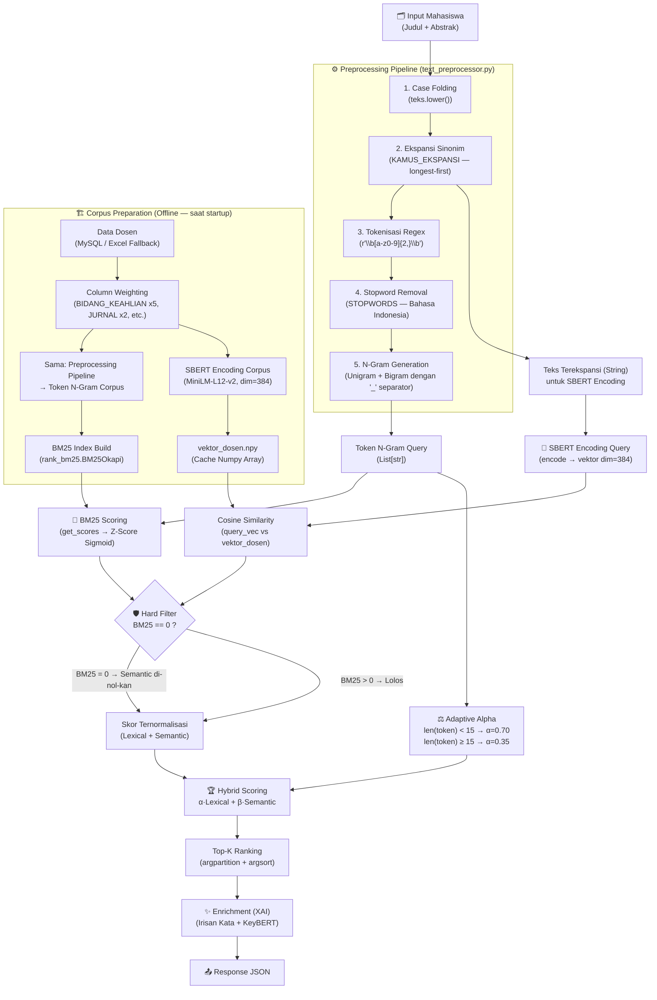

# 📐 Blueprint Model & Preprocessing — SiReDo (NLP-Based Recommendation System)

> **Versi:** V2 Refactored | **Tanggal:** Juli 2026  
> Dokumen ini adalah referensi teknis lengkap dan akurat yang dibangun langsung dari source code sistem. Setiap formula, parameter, dan keputusan desain telah diverifikasi terhadap implementasi nyata di `server/app/`.

---

## 📌 Daftar Isi

1. [Gambaran Arsitektur Pipeline](#1-gambaran-arsitektur-pipeline)
2. [Data Layer — Skema & Sumber Data](#2-data-layer--skema--sumber-data)
3. [Preprocessing Pipeline — Detail Lengkap](#3-preprocessing-pipeline--detail-lengkap)
4. [Mesin BM25 (Lexical Scoring)](#4-mesin-bm25-lexical-scoring)
5. [Mesin SBERT (Semantic Scoring)](#5-mesin-sbert-semantic-scoring)
6. [Hybrid Engine — Agregasi & Ranking](#6-hybrid-engine--agregasi--ranking)
7. [Sistem Cache & Sinkronisasi Inkremental](#7-sistem-cache--sinkronisasi-inkremental)
8. [Explainability (XAI) Layer](#8-explainability-xai-layer)
9. [Ringkasan Parameter & Konstanta](#9-ringkasan-parameter--konstanta)
10. [Referensi File Source Code](#10-referensi-file-source-code)

---

## 1. Gambaran Arsitektur Pipeline

Sistem SiReDo menggunakan paradigma **Late Fusion Hybrid Retrieval**, yaitu dua mesin retrieval (leksikal dan semantik) berjalan secara paralel pada representasi teks yang sama, kemudian hasilnya digabungkan di tahap akhir.



---

## 2. Data Layer — Skema & Sumber Data

### 2.1 Skema Database MySQL

**Tabel `dosen`** (Korpus utama sistem):

| Kolom | Tipe | Bobot Corpus | Deskripsi |
|---|---|:---:|---|
| `id_dosen` | INT (PK, AUTO) | — | Identitas unik dosen |
| `nidn` | VARCHAR(30) | — | Nomor Induk Dosen Nasional |
| `nama` | TEXT | — | Nama lengkap dosen |
| `program_studi` | TEXT | — | Program studi pengajar |
| `bidang_keahlian` | LONGTEXT | **5×** | **Kolom terkrusial** untuk indexing |
| `jurnal` | LONGTEXT | **2×** | Judul-judul jurnal/publikasi |
| `judul_bimbing` | LONGTEXT | 1× (maks 12 judul) | Riwayat judul skripsi yang dibimbing |
| `judul_uji` | LONGTEXT | 1× (maks 8 judul) | Riwayat judul skripsi yang diuji |
| `riwayat_pendidikan` | LONGTEXT | 1× | Latar belakang pendidikan formal |

**Tabel `log_rekomendasi`** (Audit trail):

| Kolom | Tipe | Deskripsi |
|---|---|---|
| `id_log` | INT (PK, AUTO) | — |
| `judul_mhs` | TEXT | Input judul dari mahasiswa |
| `abstrak_mhs` | TEXT | Input abstrak dari mahasiswa |
| `bobot_lexical` | FLOAT | Nilai α yang digunakan |
| `bobot_semantic` | FLOAT | Nilai β yang digunakan |
| `is_adaptif` | BOOL | Apakah bobot menggunakan mode adaptif |
| `batas_k` | INT | Jumlah rekomendasi yang diminta |
| `hasil_rekomendasi_json` | LONGTEXT | Hasil Top-K lengkap dalam JSON |
| `created_at` | TIMESTAMP | Waktu pencarian |

### 2.2 Strategi Fallback Data

Sistem memiliki mekanisme fallback dua lapis yang diimplementasikan di `data_loader.py`:

```
Prioritas 1: MySQL Database (db_siredo.dosen)
     ↓ Jika gagal / kosong
Prioritas 2: Excel Fallback (storage/data/data_dosen.xlsx)
     ↓ Jika gagal
Return: [] — Engine tidak aktif
```

---

## 3. Preprocessing Pipeline — Detail Lengkap

> **File Utama:** `server/app/utils/text_preprocessor.py`  
> **Class:** `PreprocessingPipeline` (semua metode statis)

Pipeline ini dijalankan untuk **dua tujuan berbeda** dengan alur yang sedikit berbeda:

| Tujuan | Input | Fungsi Utama |
|---|---|---|
| **Corpus Dosen** (offline, saat startup) | Dict row dari DB | `buat_teks_terbobot()` → `tokenize_ngram()` |
| **Query Mahasiswa** (online, saat request) | String bebas | `ekspansi_query_dengan_log()` → `tokenize_ngram()` |

### 3.1 Column Weighting (Pembobotan Kolom Corpus)

Langkah ini mengubah data dosen dari dict menjadi satu string terbobot. Diimplementasikan di `buat_teks_terbobot()`.

**Aturan Dedup Judul** (`_parse_dan_dedup_judul()`):
- Format raw dari DB: `"Judul A","Judul B","Judul C"`
- Proses: split → strip → lowercase untuk key dedup → ambil yang unik
- Batas: `judul_bimbing` maks **12 judul**, `judul_uji` maks **8 judul**

**Formula Teks Terbobot:**
```python
# Teks untuk BM25 Indexing (memiliki bobot repetisi)
inti = (BIDANG_KEAHLIAN × 5) + JUDUL_BIMBING + JUDUL_UJI + (JURNAL × 2)
teks_terbobot = inti + " " + RIWAYAT_PENDIDIKAN

# Teks untuk SBERT Encoding & KeyBERT (tanpa repetisi — untuk representasi natural)
teks_normal = RIWAYAT_PENDIDIKAN + " " + BIDANG_KEAHLIAN + " " + JURNAL + " " + JUDUL_UJI + " " + JUDUL_BIMBING
```

> **Catatan Desain:** `teks_terbobot` digunakan untuk **BM25 tokenization** dan **SBERT encoding corpus** (agar embedding juga lebih berbobot ke keahlian). Sedangkan `teks_normal` digunakan untuk **KeyBERT keyword extraction** agar hasil topik lebih representatif tanpa duplikasi.

### 3.2 Ekspansi Sinonim / Query Expansion

**File Kamus:** `server/app/utils/kamus_ekspansi.py`  
**Fungsi:** `ekspansi_query_dengan_log(teks, kamus)`

Kamus berisi **22 domain teknologi** dengan rata-rata 10–20 sinonim per entry. Contoh:

| Domain (Key) | Sinonim yang Ditambahkan |
|---|---|
| `"natural language processing"` | `nlp`, `text mining`, `bert`, `word2vec`, `embedding`, `sentiment analysis`, dll. |
| `"deep learning"` | `cnn`, `rnn`, `lstm`, `transformer`, `bert`, `mobilenet`, dll. |
| `"decision support system"` | `dss`, `spk`, `ahp`, `topsis`, `saw`, `moora`, dll. |

**Algoritma Ekspansi (Longest-First Matching):**
```python
for frasa in sorted(kamus.keys(), key=len, reverse=True):
    if frasa in teks_lower:
        # Gabungkan sinonim ke teks_ekspansi
        teks_ekspansi += " " + " ".join(kamus[frasa])
        log_ekspansi[frasa] = hasil  # Untuk keperluan XAI logging
```

> **Alasan Longest-First:** Mencegah partial match. Misal, `"deep learning"` harus dicocokkan sebelum `"learning"` agar tidak terjadi substitusi parsial yang keliru.

**Output:** Tuple `(teks_ekspansi: str, log_ekspansi: Dict[str, str])`  
- `teks_ekspansi` → dikirim ke SBERT encoding
- `log_ekspansi` → dicatat untuk debugging dan XAI

### 3.3 Tokenisasi, Stopword Removal, dan N-Gram

**Fungsi:** `tokenize_split()` dan `tokenize_ngram()`

#### Langkah 1 — Ekstraksi Token dengan Regex
```python
tokens = re.findall(r"\b[a-z0-9]{2,}\b", teks.lower())
```
- Hanya huruf alfabet kecil dan angka
- Minimum 2 karakter (mengeliminasi single-char noise)

#### Langkah 2 — Stopword Removal
- File: `server/app/utils/stopwords.py`
- Berisi daftar stopwords **Bahasa Indonesia** (kata hubung, kata ganti, kata keterangan umum)
- Filter: `[t for t in tokens if t not in STOPWORDS]`

#### Langkah 3 — N-Gram (Bigram + Unigram)
```python
bigrams = ["_".join(g) for g in ngrams(tokens_bersih, n=2)]
hasil_final = tokens_bersih + bigrams  # Unigram + Bigram
```

**Contoh Transformasi Lengkap:**

| Tahap | Contoh Output |
|---|---|
| Input Raw | `"Sistem Rekomendasi berbasis Machine Learning"` |
| After Expansion | `"Sistem Rekomendasi berbasis Machine Learning ml deep learning supervised..."` |
| After Tokenize | `["sistem", "rekomendasi", "berbasis", "machine", "learning", "ml", "deep", ...]` |
| After Stopword | `["sistem", "rekomendasi", "machine", "learning", "ml", "deep", ...]` |
| After N-Gram | `[...unigrams..., "sistem_rekomendasi", "machine_learning", "deep_learning", ...]` |

---

## 4. Mesin BM25 (Lexical Scoring)

> **File:** `server/app/services/bm25_service.py`  
> **Library:** `rank_bm25.BM25Okapi`

### 4.1 Inisialisasi Index

```python
self.mesin_bm25 = BM25Okapi(token_dosen)  # token_dosen: List[List[str]]
self.avg_idf = mean(mesin_bm25.idf.values())
self.max_idf = max(mesin_bm25.idf.values())
```

BM25 Okapi menggunakan parameter default library (`k1=1.5, b=0.75`).

### 4.2 Scoring & Normalisasi Z-Score Sigmoid

Raw BM25 menghasilkan skor tak terbatas (*unbounded*). Normalisasi dilakukan dengan **Z-Score + Sigmoid**:

```python
skor_mentah = np.array(mesin_bm25.get_scores(token_mhs))

# Guard: jika semua skor ≈ 0, return zeros
if skor_mentah.max() <= 1e-9:
    return np.zeros_like(skor_mentah)

mean = skor_mentah.mean()
std  = skor_mentah.std()

# Guard: jika distribusi flat (std ≈ 0), return zeros
if std < 1e-9:
    return np.zeros_like(skor_mentah)

# Z-Score Sigmoid dengan temperature scaling (divisor=2)
z           = (skor_mentah - mean) / std
skor_norm   = 1.0 / (1.0 + np.exp(-z / 2.0))

# Hard reset: dosen dengan BM25 mentah = 0 → dinol-kan
skor_norm[skor_mentah <= 1e-9] = 0.0
```

**Formula matematika:**

$$Z_i = \frac{BM25_i - \mu_{BM25}}{\sigma_{BM25}}$$

$$S_{lex,i} = \frac{1}{1 + e^{-Z_i / 2}} \cdot \mathbf{1}[BM25_i > 0]$$

> **Catatan Divisor `/2`:** Temperature scaling ini meratakan distribusi sigmoid, mencegah saturasi nilai pada ujung `0` dan `1` untuk dosen-dosen dengan perbedaan skor BM25 yang tidak terlalu ekstrem.

### 4.3 Adaptive Alpha Weighting

```python
def hitung_bobot_adaptif(token_mhs: List[str]) -> Tuple[float, float, List[str]]:
    if len(token_mhs) < 15:
        bobot_lex, bobot_sem = 0.70, 0.30  # Query pendek: keyword matching
    else:
        bobot_lex, bobot_sem = 0.35, 0.65  # Query panjang: semantic context

    # Bonus: Identifikasi kata langka untuk XAI
    kata_langka = [t for t in token_mhs if idf[t] > avg_idf]
    return bobot_lex, bobot_sem, list(dict.fromkeys(kata_langka))
```

| Kondisi | α (Lexical) | β (Semantic) | Rationale |
|---|:---:|:---:|---|
| `len(tokens) < 15` | **0.70** | 0.30 | Input = kata kunci singkat, exact match lebih penting |
| `len(tokens) ≥ 15` | **0.35** | **0.65** | Input = abstrak panjang, konteks semantik lebih penting |

---

## 5. Mesin SBERT (Semantic Scoring)

> **File:** `server/app/services/sbert_service.py`  
> **Library:** `sentence-transformers`, `keybert`, `sklearn`

### 5.1 Konfigurasi Model

| Parameter | Nilai |
|---|---|
| **Model Name** | `paraphrase-multilingual-MiniLM-L12-v2` |
| **Dimensi Vektor** | 384 |
| **Bahasa** | Multilingual (mendukung Bahasa Indonesia) |
| **Ukuran Model** | ~120 MB |
| **Config Path** | `server/app/config.py → Config.SBERT_MODEL_NAME` |

### 5.2 Encoding Corpus (Offline)

```python
# Input: teks_terbobot_list (sudah weight-boosted)
self.vektor_dosen = model_sbert.encode(
    teks_bobot_list,       # List[str] — satu string per dosen
    convert_to_numpy=True  # Output: np.ndarray shape (N_dosen, 384)
)
```

### 5.3 Encoding Query & Cosine Similarity

```python
# Encoding query (teks yang sudah diekspansi, BUKAN token list)
vektor_mhs = model_sbert.encode([teks_mhs_expand], convert_to_numpy=True)

# Cosine Similarity
skor_mentah = cosine_similarity(vektor_mhs.reshape(1, -1), vektor_dosen)[0]
skor_sem    = np.clip(skor_mentah, 0.0, None)  # clip ke [0, 1]
```

> **Penting:** SBERT menerima **string teks terekspansi** (bukan token list). Tokenisasi internal dilakukan oleh model transformer-nya sendiri menggunakan WordPiece/SentencePiece.

### 5.4 KeyBERT — Keyword Extraction (Offline, untuk XAI)

```python
raw_keywords = kw_model.extract_keywords(
    teks_raw_list,                # teks_normal (tanpa duplikasi)
    keyphrase_ngram_range=(1, 3), # Unigram, bigram, trigram
    stop_words=list(STOPWORDS),
    use_maxsum=True,              # Diversifikasi hasil keyword
    nr_candidates=15,             # Pool kandidat
    top_n=5                       # Ambil 5 frasa terbaik
)
```

- **Input:** `teks_normal` (bukan terbobot) — agar topik lebih representatif
- **Output:** `List[Tuple[str, float]]` — frasa beserta skor relevansinya
- **Disimpan ke:** `storage/cache/keybert_dosen.json`
- **Dijalankan:** Saat startup server (warmup) dan saat data dosen berubah

---

## 6. Hybrid Engine — Agregasi & Ranking

> **File:** `server/app/services/hybrid_engine.py`  
> **Class:** `HybridEngine`

### 6.1 Hard Constraint — Pruning Leksikal

Ini adalah **guard paling kritis** untuk mencegah false positives:

```python
# Implementasi di bm25_service.py — hitung_leksikal_normalized()
skor_norm[skor_mentah <= 1e-9] = 0.0

# Efeknya di hybrid_engine._rank():
skor_hybrid = (bobot_lex * skor_lex) + (bobot_sem * skor_sem)
# Jika skor_lex[i] = 0, dosen tersebut otomatis terpental ke posisi bawah
# karena skor_lex = 0 sementara bobot_lex adalah 0.35–0.70
```

> **Catatan Implementasi:** Hard filter di SiReDo diimplementasikan secara implisit — ketika BM25 dosen = 0, skor_lex = 0, dan karena ini dikali α (0.35–0.70), dosen tersebut otomatis terpental ke posisi bawah. Semantic Score yang tinggi tidak bisa menyelamatkannya.

### 6.2 Rumus Hybrid Score

$$\text{Hybrid Score}_i = \alpha \cdot S_{lex,i} + \beta \cdot S_{sem,i}$$

Dimana:
- $\alpha + \beta = 1$
- $\alpha, \beta$ ditentukan secara adaptif berdasarkan panjang query token
- $S_{lex,i}$ = BM25 Z-Score Sigmoid score dosen ke-i
- $S_{sem,i}$ = Cosine Similarity score dosen ke-i

### 6.3 Top-K Ranking (Efisien dengan argpartition)

```python
def _rank(skor_lex, skor_sem, bobot_lex, bobot_sem, k_rank):
    skor_hybrid = (bobot_lex * skor_lex) + (bobot_sem * skor_sem)
    n = skor_hybrid.shape[0]
    k = min(k_rank, n)

    # O(n) partial sort — lebih efisien dari full sort O(n log n)
    kandidat_idx = np.argpartition(skor_hybrid, -k)[-k:]

    # Sort hanya k kandidat — O(k log k)
    top_k_indices = kandidat_idx[np.argsort(skor_hybrid[kandidat_idx])[::-1]]
```

**Output per dosen dalam `_rank()`:**
```json
{
  "NAMA": "Dr. Budi Santoso, M.Kom",
  "PROGRAM_STUDI": "Teknik Informatika",
  "BIDANG_KEAHLIAN": "...",
  "Hybrid Score": 0.723,
  "Lexical Score": 0.681,
  "Semantic Score": 0.748,
  "Alpha": 0.35,
  "Beta": 0.65
}
```

---

## 7. Sistem Cache & Sinkronisasi Inkremental

> **File:** `server/app/services/hybrid_engine.py`  
> **Fungsi:** `siapkan_cache()`, `sinkronisasi_incremental()`

### 7.1 Struktur File Cache

```
server/storage/cache/
├── vektor_dosen.npy             ← Numpy array (N_dosen × 384)
├── vektor_dosen.npy.fingerprint ← MD5 hash seluruh data corpus
└── keybert_dosen.json           ← List[List[Tuple[str, float]]]
```

### 7.2 Mekanisme Fingerprint (Cache Validation)

```python
def _fingerprint_data(data_dosen: List[Dict]) -> str:
    payload_parts = []
    for d in data_dosen:
        bagian = "-".join([NAMA, BIDANG_KEAHLIAN, JURNAL,
                           RIWAYAT_PENDIDIKAN, judul_bimbing, judul_uji])
        payload_parts.append(bagian)
    return hashlib.md5("|".join(payload_parts).encode("utf-8")).hexdigest()
```

**Alur Startup Cache:**
```
Startup → Baca fingerprint lama dari .fingerprint file
        → Hitung fingerprint baru dari DB
        → Sama? → Load cache .npy (cepat, ~100ms)
        → Beda? → Encode ulang semua corpus SBERT (lambat, ~30-120 detik)
                → Simpan cache baru
```

### 7.3 Delta Sync — Sinkronisasi Inkremental

Ketika Admin melakukan CRUD dosen, sistem tidak menghitung ulang seluruh corpus:

```python
def sinkronisasi_incremental(data_terbaru):
    for id_dosen, dsn_baru in data_terbaru.items():
        if id_dosen in corpus_lama:
            if fingerprint(dsn_lama) == fingerprint(dsn_baru):
                # Tidak ada perubahan → reuse vektor lama
                new_vektors.append(vektor_lama[idx])
            else:
                # Ada perubahan → encode HANYA dosen ini (parsial)
                vek, kw = sbert.ekstrak_parsial(tb, tr)
                new_vektors.append(vek)
        else:
            # Dosen baru → encode
            vek, kw = sbert.ekstrak_parsial(tb, tr)
    
    # Update BM25 index dengan corpus terbaru
    bm25.siapkan(new_token_dosen)
    # Simpan cache parsial
    sbert.simpan_cache()
```

**Performa Delta Sync:** ~1–2 detik vs ~30–120 detik full recalculation.

---

## 8. Explainability (XAI) Layer

> **Fungsi:** `HybridEngine._enrich()`

Setiap hasil rekomendasi diperkaya dengan dua lapisan penjelasan:

### 8.1 Lexical Explanation — Irisan Kata

```python
mhs_set = set(token_mhs)           # Token N-Gram query mahasiswa
dsn_set = set(token_dosen[idx])    # Token N-Gram corpus dosen

irisan  = mhs_set.intersection(dsn_set)
kata_lex = [str(k).replace("_", " ") for k in irisan]
```

- **Output:** Daftar kata/frasa yang **sama persis** antara query dan profil dosen
- **Contoh:** `"machine learning, neural network, cnn"`

### 8.2 Semantic Explanation — KeyBERT Topics

```python
kw_result = sbert.keybert_data[idx]  # Pre-computed saat startup
kata_sem  = [str(k[0]) for k in kw_result]
```

- **Output:** 3–5 frasa topik utama dosen yang diekstrak secara statis
- **Catatan:** Ini adalah **topik umum dosen**, bukan match spesifik terhadap query

### 8.3 Output XAI per Dosen

```json
{
  "Irisan Kata (Lexical)": "machine learning, neural network, sistem_klasifikasi",
  "Frasa Terkait (KeyBERT)": "deep learning, computer vision, klasifikasi citra",
  "Topik Utama Dosen (statis, bukan match ke proposal)": "deep learning, computer vision, ..."
}
```

---

## 9. Ringkasan Parameter & Konstanta

| Parameter | Nilai | Lokasi |
|---|---|---|
| **SBERT Model** | `paraphrase-multilingual-MiniLM-L12-v2` | `config.py` |
| **SBERT Embedding Dim** | `384` | Model default |
| **BM25 Library** | `rank_bm25.BM25Okapi` | `bm25_service.py` |
| **BM25 k1** | `1.5` (default library) | `rank_bm25` default |
| **BM25 b** | `0.75` (default library) | `rank_bm25` default |
| **N-Gram** | Unigram + Bigram (`n=2`) | `text_preprocessor.py` |
| **Bigram Separator** | `"_"` (underscore) | `text_preprocessor.py` |
| **Min Token Length** | `2` karakter | Regex `{2,}` |
| **BM25 Normalisasi** | Z-Score Sigmoid, temperature `/2` | `bm25_service.py` |
| **Alpha (Query Pendek)** | `0.70` (BM25) + `0.30` (SBERT) | `bm25_service.py` |
| **Alpha (Query Panjang)** | `0.35` (BM25) + `0.65` (SBERT) | `bm25_service.py` |
| **Threshold Query Panjang** | `≥ 15 token` | `bm25_service.py` |
| **Bobot BIDANG_KEAHLIAN** | `×5` (repetisi) | `text_preprocessor.py` |
| **Bobot JURNAL** | `×2` (repetisi) | `text_preprocessor.py` |
| **Maks JUDUL_BIMBING** | `12 judul unik` | `text_preprocessor.py` |
| **Maks JUDUL_UJI** | `8 judul unik` | `text_preprocessor.py` |
| **Jumlah Domain Kamus** | `22 domain` | `kamus_ekspansi.py` |
| **KeyBERT n-gram range** | `(1, 3)` | `sbert_service.py` |
| **KeyBERT top_n** | `5` frasa | `sbert_service.py` |
| **KeyBERT nr_candidates** | `15` | `sbert_service.py` |
| **KeyBERT use_maxsum** | `True` (diversifikasi) | `sbert_service.py` |
| **Cache Format Vektor** | `.npy` (NumPy binary) | `config.py` |
| **Cache Format KeyBERT** | `.json` | `config.py` |
| **Fingerprint Algorithm** | `MD5` | `hybrid_engine.py` |
| **Thread Safety** | `threading.RLock()` | `hybrid_engine.py` |
| **Top-K Sorting** | `np.argpartition` + `np.argsort` | `hybrid_engine.py` |
| **Cosine Clip** | `clip(0.0, None)` | `sbert_service.py` |

---

## 10. Referensi File Source Code

| Komponen | File |
|---|---|
| Konfigurasi path & model | `server/app/config.py` |
| Preprocessing & tokenisasi | `server/app/utils/text_preprocessor.py` |
| Kamus sinonim ekspansi | `server/app/utils/kamus_ekspansi.py` |
| Daftar stopwords | `server/app/utils/stopwords.py` |
| BM25 scoring & adaptive alpha | `server/app/services/bm25_service.py` |
| SBERT encoding & KeyBERT | `server/app/services/sbert_service.py` |
| Hybrid engine, cache, delta sync | `server/app/services/hybrid_engine.py` |
| Data loader (MySQL + Excel fallback) | `server/app/services/data_loader.py` |
| Response formatter | `server/app/utils/response_formatter.py` |
| Evaluasi metrik & skenario perbaikan | `docs/EVALUASI_DAN_SKENARIO_PEMBARUAN.md` |

---

*Blueprint ini dibangun dari hasil pembacaan langsung source code SiReDo V2. Setiap nilai parameter dan alur logika telah diverifikasi terhadap implementasi aktual.*
