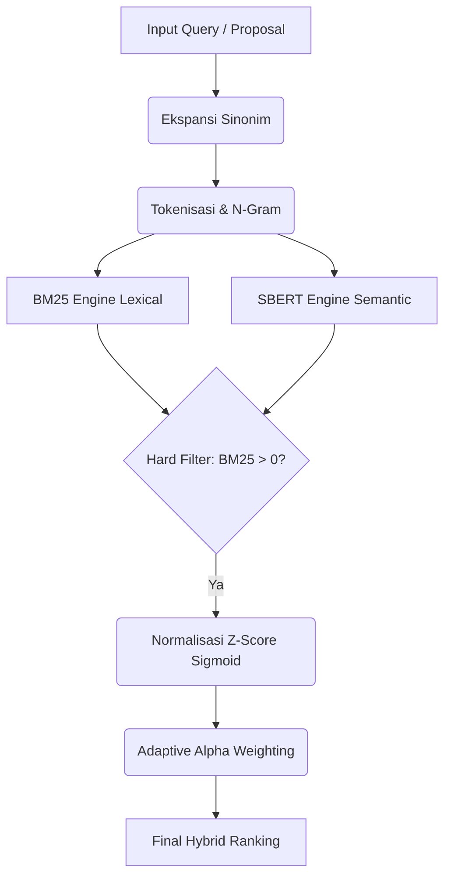

# 🏗️ Blueprint Arsitektur SiReDo: Preprocessing & Hybrid Scoring Model

Dokumen ini merupakan kerangka kerja (blueprint) komprehensif dari sistem rekomendasi berbasis NLP (Natural Language Processing) yang digunakan oleh SiReDo. Blueprint ini dirancang agar presisi, modular, dan siap diimplementasikan ulang (porting) ke dalam proyek atau bahasa pemrograman lain (seperti Node.js, Go, dll).

---

## 1. Alur Pipeline Utama
Sistem bekerja dengan skema **Late Fusion Hybrid Retrieval**. Artinya, pencarian leksikal (BM25) dan semantik (SBERT/Vector) berjalan beriringan pada teks yang sama, lalu nilainya digabung (agregasi) dan di-_filter_ sebelum menghasilkan *ranking* akhir.



---

## 2. Blueprint: Preprocessing Data (Corpus & Query)

Tahap ini mengubah teks mentah (baik dari data *database* dosen maupun input *query* pengguna) menjadi representasi teks yang kaya akan konteks.

### A. Pembobotan Kolom Meta-Data (Corpus Weighting)
Tidak semua data dosen bernilai sama. Berikan bobot dengan menduplikasi nilai teks pada field tertentu:
- `BIDANG_KEAHLIAN` : **5x repetisi** (Paling krusial)
- `JURNAL` : **2x repetisi**
- `JUDUL_BIMBING` : **1x** (Dibatasi maks 12 judul unik)
- `JUDUL_UJI` : **1x** (Dibatasi maks 8 judul unik)
- `RIWAYAT_PENDIDIKAN` : **1x**

*Pseudo-code:*
```python
inti = (keahlian * 5) + bimbing + uji + (jurnal * 2)
teks_terbobot = inti + pendidikan
```

### B. Ekspansi Sinonim (Query Expansion)
Gunakan kamus (*dictionary*) yang dipetakan (*hardcoded*) untuk mengatasi perbedaan istilah.
- Aturan: Urutkan iterasi *dictionary* dari frasa terpanjang (misal: "natural language processing") ke terpendek ("nlp") agar tidak terjadi replikasi parsial.
- Aksi: Gabungkan teks asli dengan sinonimnya.
*Contoh:* Input `Deep Learning` di-ekspansi menjadi `Deep learning dl neural network cnn rnn lstm`.

### C. Tokenisasi, Stopword, dan N-Grams
1. **Pembersihan (Regex)**: Ekstrak hanya huruf alfabet dan angka berukuran minimal 2 karakter (`\b[a-z0-9]{2,}\b`).
2. **Stopword Removal**: Buang kata hubung (misal: "dan", "yang", "adalah").
3. **N-Grams**: Bentuk Bigram (N=2) dari sisa kata dan gabungkan dengan Unigram. Gunakan *underscore* `_` untuk mengikat Bigram.
*Contoh:* `["sistem", "informasi"]` menjadi `["sistem", "informasi", "sistem_informasi"]`.

---

## 3. Blueprint: Mesin Rekomendasi (Scoring)

Sistem menggunakan 2 (dua) mesin terpisah yang dihitung secara *paralel*.

### A. Lexical Scoring (BM25 Okapi)
- **Input**: List dari token N-Gram yang dihasilkan pada tahap `2.C`.
- **Proses**: Gunakan algoritma *Okapi BM25*. Algoritma ini handal dalam pencarian *exact match* yang langka (IDF tinggi).
- **Normalisasi**: Karena rentang nilai BM25 tidak terbatas (*unbounded*), gunakan **Z-Score Sigmoid** untuk memetakannya ke rentang `[0, 1]`.
  ```python
  Z = (Skor_BM25 - Mean_BM25) / Std_BM25
  Normalized_Lexical = 1 / (1 + exp(-Z / 2))
  ```

### B. Semantic Scoring (SBERT/Vector)
- **Model Standard**: `paraphrase-multilingual-MiniLM-L12-v2` (mendukung Bahasa Indonesia dan komputasi relatif ringan).
- **Input**: Teks murni yang sudah diekspansi (bukan List Token N-Gram).
- **Proses**: 
  1. *Encode* query menjadi Vektor berdimensi 384.
  2. Hitung jarak kemiripan dengan vektor seluruh korpus menggunakan **Cosine Similarity**.
- Rentang nilai Cosine Similarity sudah berada di kisaran `[-1, 1]` atau `[0, 1]`, sehingga tidak perlu normalisasi Z-Score lagi.

---

## 4. Blueprint: Agregasi Hybrid & Mitigasi Error

Ini adalah fase terakhir yang paling krusial untuk mencegah *false positives* (dosen direkomendasikan salah jurusan).

### A. Hard Constraint (Pruning Leksikal)
- **Aturan Batal Mutlak**: Jika *Lexical Score* (BM25) seorang dosen terhadap suatu *query* bernilai mutlak `0` (tidak ada satupun kata yang sama), maka secara otomatis *Semantic Score* dosen tersebut **DI-NOL-KAN** (0).
- Hal ini mencegah model SBERT menaikkan dosen yang abstrak kalimatnya serupa tapi isi teknisnya sama sekali berbeda.

### B. Adaptive Alpha Weighting (Bobot Dinamis)
Persamaan Hybrid: `Skor_Akhir = (Alpha * Lexical) + (Beta * Semantic)`
Dimana `Beta = 1 - Alpha`. 
Tentukan `Alpha` secara dinamis dengan mengukur panjang *query*:
- **Jika Token Query < 15 kata**: Pengguna hanya memasukkan kata kunci. Algoritma leksikal harus merajai.
  `Alpha = 0.70`, `Beta = 0.30`
- **Jika Token Query >= 15 kata**: Pengguna memasukkan kalimat abstrak panjang. Algoritma semantik harus diutamakan.
  `Alpha = 0.35`, `Beta = 0.65`

### C. Enrichment (Fitur Antarmuka)
Saat mengembalikan *Top-K* ke sistem UI:
1. Cari *irisan kata* (intersection) antara token query mahasiswa dan token profil dosen untuk menyoroti ("Highlight") alasan kecocokan leksikal.
2. Gunakan *KeyBERT* pada profil dosen (dihitung saat *warming up server*) untuk mengekstrak 3-5 label topik utama sang dosen sebagai rangkuman profil statis.
