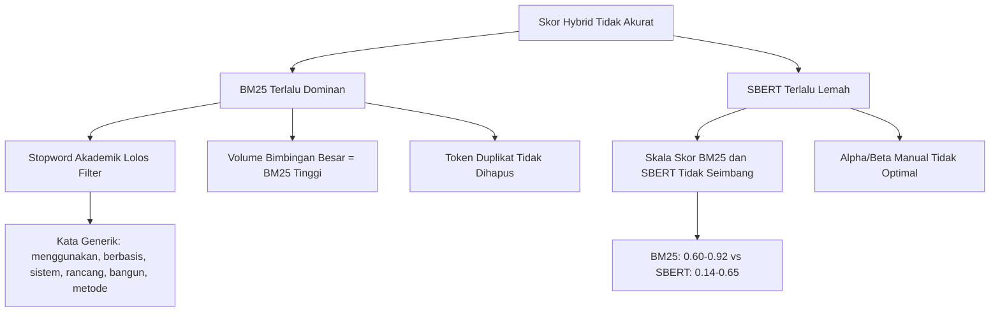

# Audit Kualitas Rekomendasi NLP Engine SiReDo

Dokumen ini merupakan hasil analisis kualitatif terhadap output rekomendasi Top-5 dosen pembimbing yang dihasilkan oleh pipeline Hybrid NLP SiReDo. Data diambil dari file `server/storage/data/recommendation_top5_results.json` yang di-generate menggunakan **86 profil dosen real** dari database Politeknik Negeri Batam.

---

## 1. Ringkasan Eksekusi Pengujian

| Parameter | Nilai |
|---|---|
| Jumlah Tesis Diuji | 5 skenario (hardcoded) |
| Jumlah Dosen dalam Database | 86 profil |
| Mode Pembobotan | `manual` (alpha=0.6, beta=0.4) |
| Format Output | JSON terstruktur per-tesis |
| Threshold | 0.0 (tanpa batas minimum skor) |

---

## 2. Matriks Hasil Rekomendasi Per Tesis

### TESIS-001: Natural Language Processing

> **Judul:** Implementasi Model Sentence-BERT dan BM25 untuk Rekomendasi Dosen Pembimbing Skripsi Berbasis Hybrid NLP

| Rank | Nama Dosen | Prodi | Bidang Keahlian | Hybrid | BM25 | SBERT |
|---|---|---|---|---|---|---|
| 1 | Supardianto, S.ST., M.Eng | TRPL | Ilmu Komputer | 0.6542 | 0.7746 | 0.4735 |
| 2 | Ahmadi Irmansyah Lubis, S.kom., M.kom. | TRPL | AI, DSS, ML, CS | 0.6335 | 0.8045 | 0.3770 |
| 3 | Hilda Widyastuti, S.T., M.T. | Teknik Informatika | Kecerdasan Buatan | 0.5966 | 0.6789 | 0.4732 |
| 4 | Metta Santiputri, S.T., M.Sc, Ph.D | Teknik Komputer | Software Engineering | 0.5693 | 0.7187 | 0.3453 |
| 5 | Dwi Amalia Purnamasari, S.T., M.Cs | Teknik Informatika | Software Development | 0.5506 | 0.7144 | 0.3048 |

**Penilaian Relevansi:** Cukup. Rank #2 (AI/ML) dan Rank #3 (Kecerdasan Buatan) memiliki kecocokan domain yang baik. Namun Rank #1 (Ilmu Komputer umum) mendominasi karena volume kata kunci generik yang tinggi pada riwayat bimbingannya.

---

### TESIS-002: Computer Vision

> **Judul:** Deteksi dan Klasifikasi Kendaraan Menggunakan Algoritma YOLOv8 pada Citra Udara Drone

| Rank | Nama Dosen | Prodi | Bidang Keahlian | Hybrid | BM25 | SBERT |
|---|---|---|---|---|---|---|
| 1 | Agung Riyadi, S.Si., M.Kom | TR Multimedia | Artificial Intelligence | 0.7308 | 0.8963 | 0.4825 |
| 2 | Wenang Anurogo, S.Si., M.Sc. | Teknologi Geomatika | Remote Sensing, GIS | 0.6844 | 0.8042 | 0.5047 |
| 3 | Fendra Dwi R | Teknologi Geomatika | Aplikasi SIG, Penginderaan Jauh | 0.6340 | 0.7978 | 0.3882 |
| 4 | Nur Cahyono Kushardianto, S.Si., M.T., M.Sc | Teknik Komputer | Computer Network, ML | 0.6150 | 0.6544 | 0.5559 |
| 5 | Luthfiya Ratna Sari, S.Si., M.T. | Teknologi Geomatika | GIS, Kartografi | 0.5775 | 0.6756 | 0.4305 |

> [!WARNING]
> **Temuan Kritis:** 3 dari 5 dosen (Rank #2, #3, #5) berasal dari prodi **Teknologi Geomatika**, bukan Computer Vision / Deep Learning. Mereka masuk karena overlap leksikal BM25 pada kata "citra", "udara", "drone", "digital" yang lazim digunakan dalam penginderaan jauh dan kartografi, bukan dalam konteks CNN/YOLO.

---

### TESIS-003: Decision Support System

> **Judul:** Sistem Pendukung Keputusan Penentuan Kelayakan Penerima Bantuan Pangan Menggunakan Metode AHP dan TOPSIS

| Rank | Nama Dosen | Prodi | Bidang Keahlian | Hybrid | BM25 | SBERT |
|---|---|---|---|---|---|---|
| 1 | Ahmadi Irmansyah Lubis, S.kom., M.kom. | TRPL | AI, DSS, ML, CS | 0.6561 | 0.8480 | 0.3683 |
| 2 | Noper Ardi, S.Pd., M.Eng | TRPL | RPL, AI | 0.6336 | 0.9221 | 0.2009 |
| 3 | Nur Israyani, S.T, M.T | Teknologi Geomatika | GIS | 0.5766 | 0.7668 | 0.2912 |
| 4 | Cyntia Lasmi | Teknik Informatika | AI, Data Mining | 0.5169 | 0.7158 | 0.2184 |
| 5 | Wenang Anurogo, S.Si., M.Sc. | Teknologi Geomatika | Computer Network, Information Security | 0.5134 | 0.7623 | 0.1400 |

**Penilaian Relevansi:** Parsial. Rank #1 sangat tepat (bidang DSS). Rank #2 memiliki BM25 tertinggi (0.9221) karena riwayat bimbingannya mengandung banyak kata kunci SPK. Namun Rank #3 dan #5 (Geomatika) sepenuhnya tidak relevan, dan Rank #5 Wenang Anurogo mendapat SBERT sangat rendah (0.14) yang seharusnya bisa menjadi sinyal penolakan.

---

### TESIS-004: Cyber Security

> **Judul:** Analisis Keamanan Jaringan Menggunakan Kombinasi Algoritma Enkripsi AES-256 dan Steganografi LSB

| Rank | Nama Dosen | Prodi | Bidang Keahlian | Hybrid | BM25 | SBERT |
|---|---|---|---|---|---|---|
| 1 | Antoni Haikal, S.ST.,M.T | Rekayasa Keamanan Siber | App Security, Offensive Security | 0.7602 | 0.8832 | 0.5757 |
| 2 | Festy Winda Sari, S.Tr. Kom | Rekayasa Keamanan Siber | App Security, Web Security | 0.6369 | 0.6246 | 0.6554 |
| 3 | Dodi Prima Resda, S.Pd., M.Kom | Rekayasa Keamanan Siber | Rekayasa Keamanan Siber | 0.6300 | 0.6709 | 0.5686 |
| 4 | Nelmiawati, B.CS., M.Comp.Sc | Rekayasa Keamanan Siber | Computer Network, Info Security | 0.6291 | 0.6209 | 0.6414 |
| 5 | Andy Triwinarko, ST., MT., Ph.D | TR Multimedia | Telecommunication, Informatics | 0.6139 | 0.8140 | 0.3138 |

> [!TIP]
> **Hasil Terbaik.** 4 dari 5 dosen (Rank #1-#4) berasal dari prodi Rekayasa Keamanan Siber dengan bidang keahlian yang sangat relevan. Skor SBERT juga paling seimbang dibandingkan tesis lainnya (0.57-0.65), menandakan bahwa SBERT berhasil menangkap konteks semantik keamanan. Hanya Rank #5 yang kurang relevan (bidang Telekomunikasi/Multimedia).

---

### TESIS-005: Internet of Things

> **Judul:** Rancang Bangun Sistem Monitoring Kualitas Udara Berbasis Internet of Things dan Mikrokontroler ESP32

| Rank | Nama Dosen | Prodi | Bidang Keahlian | Hybrid | BM25 | SBERT |
|---|---|---|---|---|---|---|
| 1 | Supardianto, S.ST., M.Eng | TRPL | Ilmu Komputer | 0.7064 | 0.8685 | 0.4632 |
| 2 | Hamdani Arif, S.Pd., M.Sc | Rekayasa Keamanan Siber | Networking, IoT | 0.6155 | 0.7809 | 0.3674 |
| 3 | Metta Santiputri, S.T., M.Sc, Ph.D | Teknik Komputer | Software Engineering | 0.5777 | 0.6509 | 0.4678 |
| 4 | Cyntia Lasmi | Teknik Informatika | AI, Data Mining | 0.5704 | 0.7101 | 0.3609 |
| 5 | Cahya Miranto, S.S.T., M.Tr.Kom. | TR Multimedia | **Animasi 3D** | 0.5701 | 0.7219 | 0.3423 |

> [!WARNING]
> **Temuan Bermasalah:** Rank #2 (IoT expert) seharusnya menjadi Rank #1, karena bidang keahliannya langsung relevan. Rank #5 adalah dosen **Animasi 3D** yang sama sekali tidak relevan dengan IoT, namun mendapatkan BM25 tinggi (0.7219) karena irisan kata generik ("rancang", "bangun", "sistem", "monitoring", "berbasis").

---

## 3. Analisa Diagnostik Mesin NLP

### 3.1 Distribusi Kontribusi Skor BM25 vs SBERT

```
                  BM25 Range        SBERT Range       Gap
TESIS-001 (NLP)   0.6789 - 0.8045   0.3048 - 0.4735   ~0.35
TESIS-002 (CV)    0.6544 - 0.8963   0.3882 - 0.5559   ~0.30
TESIS-003 (DSS)   0.7158 - 0.9221   0.1400 - 0.3683   ~0.50
TESIS-004 (Sec)   0.6209 - 0.8832   0.3138 - 0.6554   ~0.20
TESIS-005 (IoT)   0.6509 - 0.8685   0.3423 - 0.4678   ~0.35
```

> [!IMPORTANT]
> **Temuan Utama:** Skor BM25 secara konsisten **2-4x lebih tinggi** dari skor SBERT. Dengan pembobotan alpha=0.6 (BM25) dan beta=0.4 (SBERT), kontribusi efektif SBERT terhadap skor Hybrid hanya sekitar **10-26%** dari total skor akhir. Ini menyebabkan perangkingan hampir sepenuhnya didikte oleh overlap kata leksikal (BM25), sehingga **kekuatan pembeda semantik SBERT tidak terpakai secara efektif**.

### 3.2 Analisa Preprocessing & Ekspansi Query

| Aspek | Temuan |
|---|---|
| **Stopword Filtering** | Kata generik akademik seperti `menggunakan`, `berbasis`, `sistem`, `rancang`, `bangun`, `metode`, `informasi` **lolos filter stopword** dan menjadi token aktif. Ini menyebabkan semua dosen yang memiliki riwayat bimbingan sistem informasi apapun mendapatkan skor BM25 tinggi secara palsu. |
| **Ekspansi Query** | Hanya terdeteksi pada 2 dari 5 tesis: TESIS-002 ("deep learning") dan TESIS-005 ("internet of things"). Frasa kunci domain seperti "Sentence-BERT", "BM25", "AHP", "TOPSIS", "AES-256", "steganografi" **tidak diekspansi**. |
| **Token Duplikat** | Terdapat token duplikat dalam `final_tokens` (misal "citra" muncul 2x pada TESIS-002) yang berpotensi memperkuat skor BM25 secara tidak proporsional. |

### 3.3 Analisa Irisan Kata (XAI) - Kualitas Explainability

Irisan kata kunci yang ditampilkan XAI untuk menjelaskan relevansi sering didominasi oleh kata-kata **generik non-diskriminatif**:

| Tesis | Irisan Kata yang Generik (Noise) | Irisan Kata yang Relevan (Signal) |
|---|---|---|
| TESIS-001 | `berbasis`, `sistem`, `informasi`, `menggunakan` | `rekomendasi`, `dosen`, `nlp` |
| TESIS-002 | `berbasis`, `menggunakan`, `digital` | `deteksi`, `klasifikasi`, `citra`, `neural`, `deep`, `learning` |
| TESIS-003 | `menggunakan`, `metode`, `sistem` | `decision`, `keputusan`, `pendukung`, `topsis`, `ahp` |
| TESIS-004 | `analisis`, `menggunakan` | `keamanan`, `jaringan`, `aes` |
| TESIS-005 | `bangun`, `berbasis`, `rancang`, `sistem`, `of` | `internet`, `things`, `monitoring`, `sensor` |

### 3.4 Anomali Data

| Anomali | Detail |
|---|---|
| **NIDN Kosong** | Seluruh 86 dosen dalam database memiliki field `nidn: ""`. Data NIDN tidak tersedia dari sumber dataset awal. |
| **Dosen Berulang** | Dosen **Supardianto** mendominasi Rank #1 pada 2 tesis berbeda (NLP dan IoT) meskipun bidangnya hanya "Ilmu Komputer" umum. Ini karena volume riwayat bimbingannya sangat besar (~52 judul), sehingga BM25 selalu menemukan overlap. |
| **Dosen Tidak Relevan** | Dosen **Cahya Miranto** (Animasi 3D, TR Multimedia) muncul di Top-5 pada tesis DSS dan IoT, murni karena overlap kata generik BM25 tanpa kecocokan semantik. |
| **Dosen Geomatika** | Dosen dari prodi **Teknologi Geomatika** (Remote Sensing, GIS) muncul berulang di tesis Computer Vision dan DSS karena shared vocabulary ("citra", "analisis", "metode", "multi criteria"). |

---

## 4. Skor Kualitas Keseluruhan

| Tesis | Presisi Relevansi (Top-5) | Keterangan |
|---|---|---|
| TESIS-001 (NLP) | **3/5 (60%)** | Rank #2, #3 relevan. Rank #1, #4, #5 generik. |
| TESIS-002 (CV) | **2/5 (40%)** | Rank #1, #4 relevan. Rank #2, #3, #5 Geomatika (false positive). |
| TESIS-003 (DSS) | **2/5 (40%)** | Rank #1, #4 relevan. Rank #3, #5 Geomatika (false positive). |
| TESIS-004 (Sec) | **4/5 (80%)** | Rank #1-#4 sangat relevan. Rank #5 marginal. |
| TESIS-005 (IoT) | **2/5 (40%)** | Rank #2 relevan. Rank #1 generik. Rank #5 Animasi 3D (false positive). |

**Rata-rata Presisi Relevansi Top-5: 52% (13/25 rekomendasi relevan)**

---

## 5. Diagnosis Akar Masalah



### 5.1 Daftar Akar Masalah (Prioritas Tertinggi ke Terendah)

1. **Stopword akademik yang lolos filter** -- Kata seperti `menggunakan`, `berbasis`, `sistem`, `rancang`, `bangun`, `metode`, `informasi`, `analisis`, `penerapan` seharusnya dihapus dari token query dan corpus karena tidak memiliki daya diskriminatif terhadap bidang keahlian.

2. **Skala skor BM25 dan SBERT tidak dinormalisasi ke rentang yang sama** -- BM25 menghasilkan skor dalam rentang 0.60-0.92, sedangkan SBERT hanya 0.14-0.65. Tanpa normalisasi skala, pembobotan alpha/beta menjadi bias terhadap BM25.

3. **Ekspansi kamus query terlalu terbatas** -- Hanya 2 dari 10+ terminologi teknis yang berhasil diperluas. Kamus ekspansi perlu diperkaya untuk domain seperti NLP (bert, transformer, embedding), DSS (ahp, topsis, saw, wp), Keamanan (aes, rsa, steganografi), dan IoT (esp32, arduino, sensor, mqtt).

4. **Deduplikasi token final belum diterapkan** -- Token duplikat seperti "citra" yang muncul 2x pada input memperkuat skor BM25 secara artifisial.

5. **Threshold skor minimum terlalu rendah (0.0)** -- Tidak ada filter minimum yang mencegah dosen dengan skor rendah masuk Top-5.

---

## 6. Rekomendasi Perbaikan

> [!NOTE]
> Rekomendasi berikut diurutkan berdasarkan dampak yang diharapkan terhadap presisi rekomendasi.

### Prioritas Tinggi (Dampak Besar)

| No | Rekomendasi | Komponen yang Terpengaruh | Estimasi Dampak |
|---|---|---|---|
| 1 | **Tambahkan stopword akademik teknis** ke daftar stopwords: `menggunakan`, `berbasis`, `sistem`, `rancang`, `bangun`, `metode`, `informasi`, `analisis`, `penerapan`, `implementasi`, `studi`, `kasus`, `pada`, `untuk`, `dengan` | `preprocessor.py`, `stopwords.py` | Menghilangkan false positive BM25 dari kata generik |
| 2 | **Normalisasi skala skor** BM25 dan SBERT ke rentang [0, 1] yang seimbang sebelum pembobotan hybrid (misal: Min-Max per-query atau Z-score) | `hybrid_scorer.py` | Menyeimbangkan kontribusi leksikal dan semantik |
| 3 | **Perkaya kamus ekspansi query** dengan domain NLP, CV, DSS, Security, IoT | `kamus_ekspansi.py` | Meningkatkan recall dan presisi pencarian domain-spesifik |

### Prioritas Sedang (Dampak Menengah)

| No | Rekomendasi | Komponen yang Terpengaruh | Estimasi Dampak |
|---|---|---|---|
| 4 | **Deduplikasi token** pada final_tokens sebelum kalkulasi BM25 | `preprocessor.py` | Mencegah inflasi skor leksikal dari token berulang |
| 5 | **Aktifkan mode adaptif** (alih-alih manual alpha=0.6) agar query panjang/abstrak otomatis memprioritaskan SBERT | `hybrid_scorer.py`, `config_service.py` | Meningkatkan kontribusi SBERT pada query deskriptif |
| 6 | **Terapkan threshold minimum** skor hybrid (misal: 0.3) untuk memfilter kandidat tidak relevan | `recommendation_service.py` | Menghilangkan rekomendasi dengan skor sangat rendah |

### Prioritas Rendah (Perbaikan Data)

| No | Rekomendasi | Komponen yang Terpengaruh | Estimasi Dampak |
|---|---|---|---|
| 7 | **Lengkapi data NIDN** seluruh dosen di database | Dataset sumber | Memperbaiki identifikasi unik dosen |
| 8 | **Normalisasi bidang keahlian** dosen agar terminologi seragam (misal: "Kecerdasan Buatan" = "Artificial Intelligence") | `dosen_importer.py` | Meningkatkan akurasi SBERT pada pencocokan semantik bidang keahlian |

---

## 7. Kesimpulan

Pipeline Hybrid NLP SiReDo telah **berhasil berfungsi secara end-to-end** dan mampu menghasilkan rekomendasi dosen pembimbing dengan format output yang lengkap (profil, skor, XAI). Namun, **kualitas presisi rekomendasi masih berada di angka 52%** (13 dari 25 rekomendasi relevan) yang menandakan bahwa mesin NLP memerlukan perbaikan pada **3 area kritis**: filtering stopword akademik, normalisasi skala skor, dan perluasan kamus ekspansi query.

Hasil terbaik diperoleh pada tesis Cyber Security (presisi 80%) dimana terminologi domain bersifat spesifik dan jarang overlap dengan bidang lain. Hasil terburuk pada tesis Computer Vision dan Decision Support System (presisi 40%) dimana vocabulary bersifat generik dan mudah overlap antar domain (citra/udara/analisis/metode).

---

*Dokumen ini digenerate pada 2026-08-28 berdasarkan data `recommendation_top5_results.json` dari database 86 profil dosen Politeknik Negeri Batam.*
