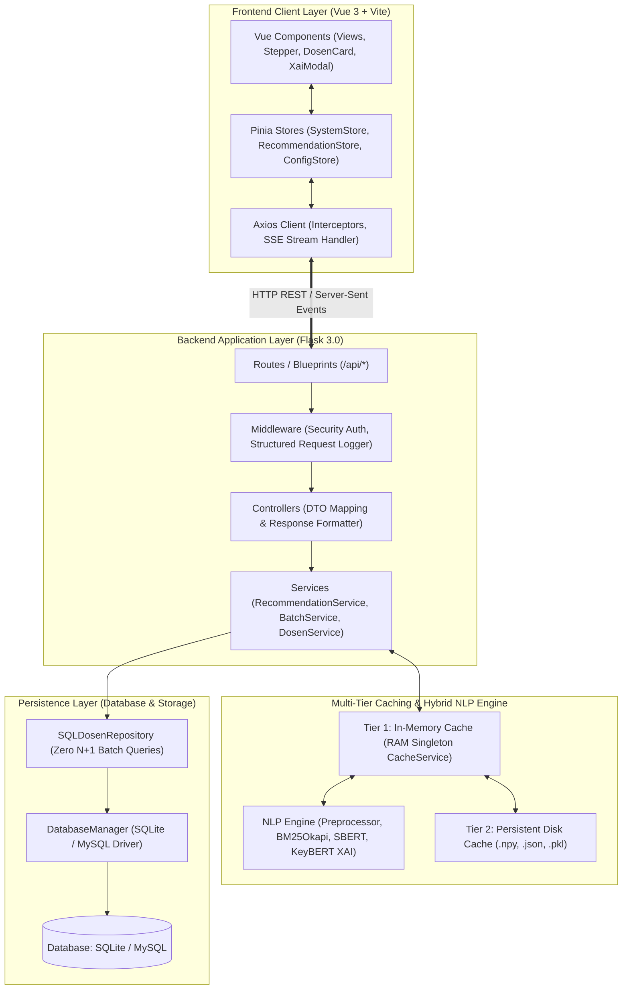
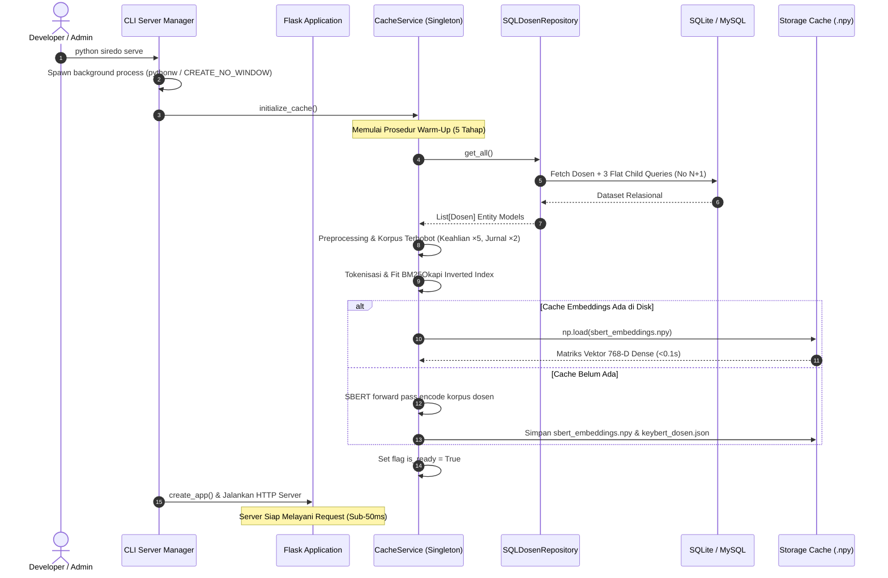
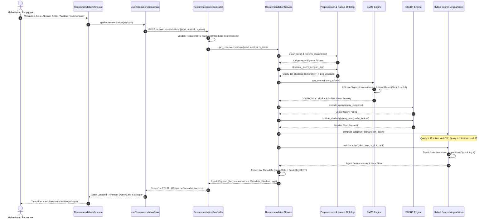
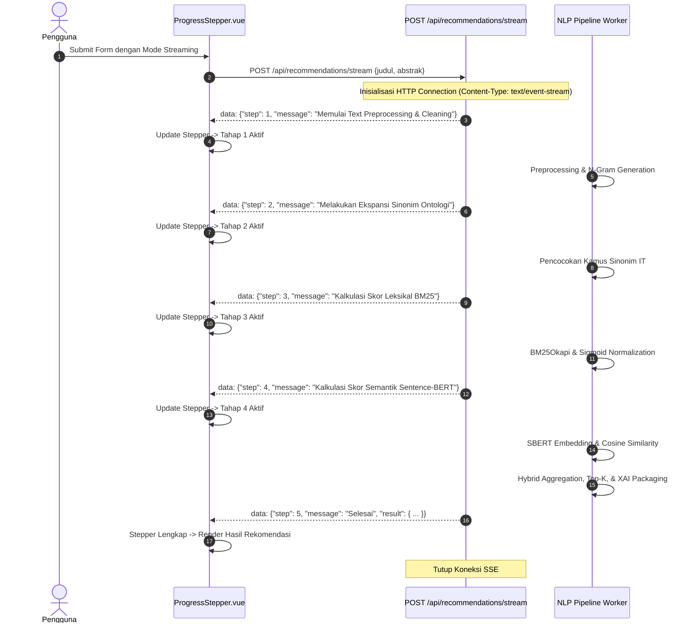
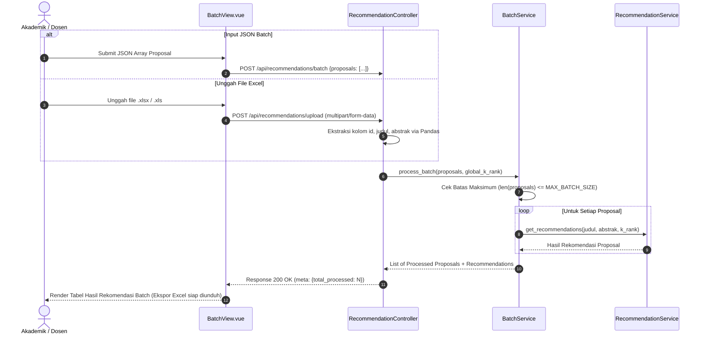
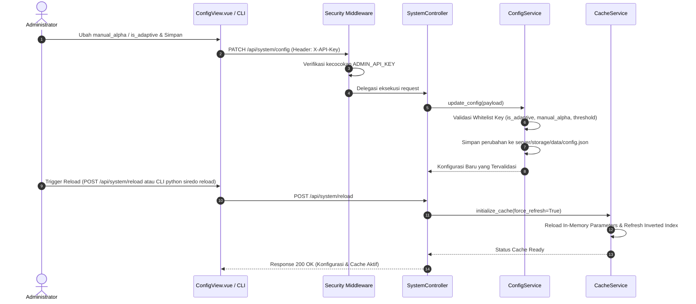
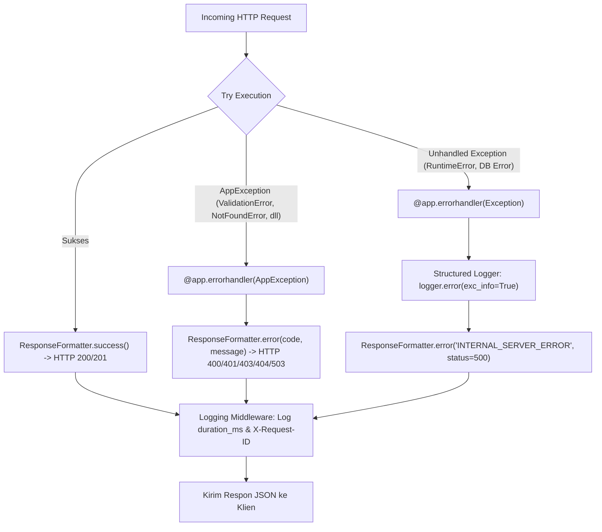

# Desain Sistem & Alur Kerja (System Flow) — SiReDo v3

Dokumentasi ini menyajikan rancangan arsitektur sistem (*System Design*) dan alur kerja data (*System Flow*) secara sistematis, detail, dan komprehensif pada platform **SiReDo v3**.

---

## 1. Topologi Arsitektur Sistem

SiReDo v3 mengusung pola arsitektur **Decoupled Fullstack** dengan pemisahan tegas antara Client Presentation, Backend Application Engine, Multi-Tier Caching, dan Relational Persistence:

---

## 2. Diagram Alur Kerja Utama Sistem (Core System Flows)

---

### Alur 1: Inisialisasi Server & Cache Warm-Up (Server Startup Flow)

Alur yang dieksekusi saat perintah `python siredo serve` dijalankan:

---

### Alur 2: Rekomendasi Single Proposal (Recommendation Pipeline Flow)

Alur pemrosesan saat mahasiswa mengirimkan judul dan abstrak penelitian:

---

### Alur 3: Streaming Real-Time Rekomendasi (Server-Sent Events Flow)

Alur eksekusi rekomendasi dengan visualisasi progres tahapan per detik menggunakan SSE:

---

### Alur 4: Pemrosesan Batch Proposal & File Spreadsheet

Alur saat memproses banyak proposal penelitian mahasiswa secara massal:

---

### Alur 5: Hot Reload & Pembaruan Konfigurasi (Zero-Downtime Flow)

Alur saat administrator mengubah parameter algoritma tanpa mematikan proses server:

---

### Alur 6: Manajemen Data & Provisioning Database

Alur provisioning skema dan pemindahan data master:

```mermaid
graph TD
    subgraph Migration_Flow ["1. Alur Migrasi DDL (python siredo db:migrate)"]
        M1["Mulai: python siredo db:migrate"] --> M2["Buka Koneksi via DatabaseManager"]
        M2 --> M3{"MySQL Aktif?"}
        M3 -- Ya --> M4["CREATE DATABASE IF NOT EXISTS db_siredo"]
        M3 -- Tidak / Error --> M5["Fallback ke SQLite lokal"]
        M4 --> M6["Buat Tabel migrations (Tracking)"]
        M5 --> M6
        M6 --> M7["Eksekusi 001_create_dosen_tables.py (up)"]
        M7 --> M8["Catat riwayat ke tabel migrations"]
    end

    subgraph Import_Flow ["2. Alur Impor Dataset (python siredo db:import)"]
        I1["Mulai: python siredo db:import"] --> I2["Baca dataset_profiles_terintegrasi.xlsx"]
        I2 --> I3["DosenImporter.validate_and_transform_row()"]
        I3 --> I4["Parsing Tanda Petik & Titik Koma (Publikasi, Bimbingan, Ujian)"]
        I4 --> I5["SQLDosenRepository.truncate_all()"]
        I5 --> I6["SQLDosenRepository.save_batch() (Atomic Transaction)"]
        I6 --> I7["Commit Database Relasional"]
    end

    subgraph Export_Flow ["3. Alur Ekspor Data (python siredo db:export)"]
        E1["Mulai: python siredo db:export"] --> E2["SQLDosenRepository.get_all()"]
        E2 --> E3["4 Flat Batch Queries (Master Dosen + 3 Child Tables)"]
        E3 --> E4["In-Memory Grouping via defaultdict (Zero N+1)"]
        E4 --> E5["Konversi ke DataFrame Pandas"]
        E5 --> E6["Simpan ke server/storage/data/dataset_profiles_exported.xlsx / .json"]
    end
```

---

## 3. Penanganan Error Terpusat & Ketahanan Sistem (Resilience Flow)

Semua error pada level aplikasi ditangani melalui arsitektur terpusat (*Centralized Error Handling*):

---

## 4. Matriks Ringkasan Latensi Tiap Alur Sistem

| Alur Sistem | Rata-Rata Latensi | Karakteristik Operasi | Komponen Utama |
|---|---|---|---|
| **Health Check** | $< 2\text{ ms}$ | Status boolean in-memory | `GET /health` |
| **Katalog Dosen** | $< 10\text{ ms}$ | JSON serialization dari RAM | `GET /api/dosen` |
| **Rekomendasi Single** | $20\text{--}40\text{ ms}$ | In-memory BM25 + SBERT 1 query + SIMD Cosine | `POST /api/recommendations` |
| **Rekomendasi SSE Stream**| Real-time step ($\sim 0.5\text{ s}$) | 5 tahapan event berurutan | `POST /api/recommendations/stream`|
| **Rekomendasi Batch (10 Proposal)** | $200\text{--}350\text{ ms}$ | Iterasi in-memory batch | `POST /api/recommendations/batch` |
| **Hot Reload Cache** | $< 300\text{ ms}$ | Reload disk cache & fitting BM25 | `POST /api/system/reload` |
| **Warm-Up Startup Server** | $< 500\text{ ms}$ (cache hit) / $\sim 20\text{ s}$ (cache miss)| Pemuatan biner tensor `.npy` | `CacheService._warm_up()` |
